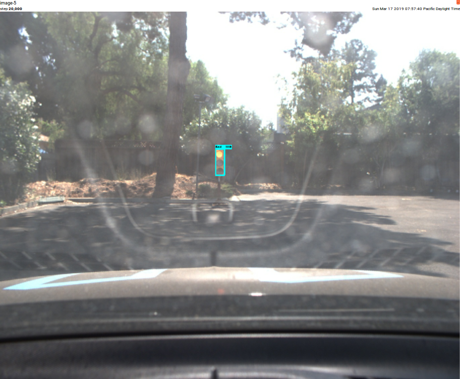
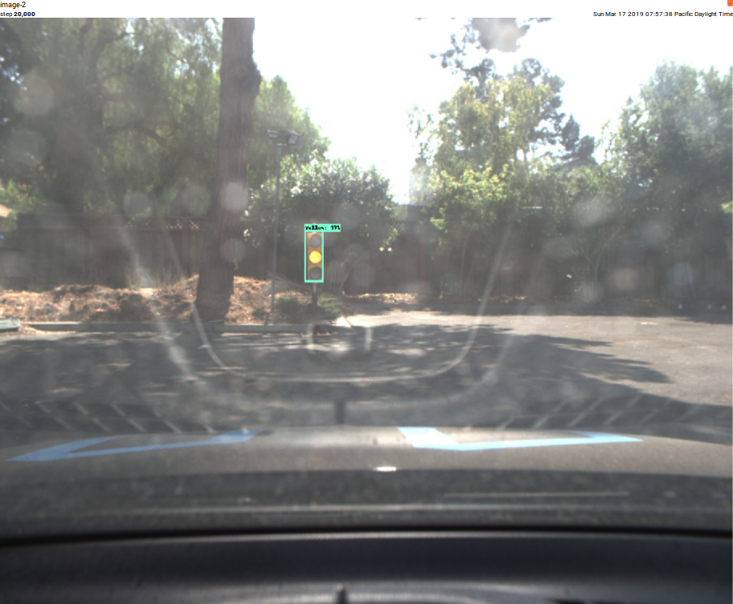

# Traffic Light Classification
---
**Traffic Light Classification**

The goals/steps of this project are the following:

* Gather and label the datasets
* Transfer learning on a TensorFlow model
* Classify the state of traffic lights
* Summarize the results with a written report

[//]: #(References)
[Capstone]: https://github.com/kds123/Udacity-CarND-Capstone
[cuda8.0]: https://developer.nvidia.com/rdp/cudnn-archive
[Anaconda]: https://www.anaconda.com/distribution/
[NVIDIA]: https://developer.nvidia.com/rdp/cudnn-download
[ssd inception]: http://download.tensorflow.org/models/object_detection/ssd_inception_v2_coco_11_06_2017.tar.gz 
[faster rcnn inception]: http://download.tensorflow.org/models/object_detection/faster_rcnn_inception_v2_coco_2018_01_28.tar.gz
[detection models zoo]: https://github.com/tensorflow/models/blob/master/research/object_detection/g3doc/detection_model_zoo.md
[alex lechner dataset]: https://www.dropbox.com/s/vaniv8eqna89r20/alex-lechner-udacity-traffic-light-dataset.zip?dl=0
[alex lechner]: https://github.com/alex-lechner/Traffic-Light-Classification
[coldknight]: https://github.com/coldKnight/TrafficLight_Detection-TensorFlowAPI
[overtakers]: https://github.com/overtakers/traffic-light-classification
[kinshuk4]: https://github.com/kinshuk4/CarND-TrafficLight-Classification
[Tensorboard site]: https://www.tensorflow.org/guide/summaries_and_tensorboard

---

1. [Introduction](#introduction)

2. [Computer Used for Training](#Computer-Used-for-Training)
	1. [Computer Spec](#a-Computer-Spec)
	2. [Computer Environment](#b-Computer-Environment)

3. [Datasets](#datasets)

4. [Training](#Training)
    1. [Prepare Workspace](#a-Prepare-Workspace)
	2. [Copy Datasets](#b-Copy-Datasets)
    2. [Choosing a Training Model](#c-Choosing-a-Training-Model)
    3. [Create a TFRecord File](#d-Create-a-TFRecord-File)
    4. [Create a Config File](#e-Create-a-Config-File)
    5. [Training the Model](#f-Training-the-model)
	6. [Freezing the Graph](#g-Freezing-the-graph)
	7. [Evaluating the Model](#i-Evaluating-the-model)
	8. [View the Result with Tensorboard](#f-View-the-Result-with-Tensorboard)


## Introduction

As part of [Udacity Capstone project][Capstone], we trained a TensorFlow model to classify traffic light using images of traffic lights with different light states which was green, yellow, red and other. This trained model was used in the Udacity Self-Driving Car Nanodegree project.

To better understand how Traffic light classification works, I googled and referenced several Medium and github post from previous Udacity Self-Driving Car Student.   

## Computer Used for Training

#### a. Computer Spec

DELL Precision T1600 
* CPU           Intel Xeon CPU E31235
* RAM           16 GB
* Graphic Card  NVIDIA Quadro K620 with 2GB
* OS            Ubuntu 16.04 LTS

#### b. Computer Environment 

In this project, we must use TensorFlow 1.4 in order to run under Udacity Carla And along with TensorFlow 1.4, I installed CUDA 8.0 and cudnn 7.0.5 by following instruction.

1. Install NVIDIA Graphics Driver
    ```
    sudo apt-get install nvidia-384 nvidia-modprobe
    ```
2. Download and Install CUDA 8.0 with cudnn 7.0.5

   Explore and Download [Cuda 8.0 with cudnn 7.0.5][cuda8.0] from [NVIDIA site][NVIDIA]
    ```    
   sudo dpkg -i libcudnn7_7.0.5.15–1+cuda8.0_amd64.deb
    ```
3. Install the following packages 
    ```
    sudo apt-get install protobuf-compiler python-pil python-lxml python-tk
    ```
4. Download and Install Anaconda

   Explore and Download [latest Anaconda][Anaconda]
    ```
   curl -O https://repo.anaconda.com/archive/Anaconda3-2018.12-Linux-x86_64.sh
    ```
	
   Install Anaconda
    ```
   bash Anaconda3-2018.12-Linux-x86_64.sh
    ```
	
   create Conda enviroment with tensorflow-gpu 2.4 version and Activate the conda
    ```
   conda create --name capstone tensorflow-gpu=1.4 
   source activate capstone
    ```

5. Get pre build tensorflow models for object detection

   Clone TensorFlow's *models* repository  
    ```
    git clone https://github.com/tensorflow/models.git
    ```
   Checkout branch which work under the TensorFlow 1.4.

    This is important because the code from the ``master`` branch won't work with TensorFlow v1.4. Also, this commit has already fixed broken models from previous commits.
    ```
    cd ./models/
    git checkout f7e99c0
    ```

   Navigate to the ``research`` folder and execute 
    ```
    cd ./research/
    protoc object_detection/protos/*.proto --python_out=.

    export PYTHONPATH=$PYTHONPATH:`pwd`:`pwd`/slim
    ```
   If the step 3 executed without any errors then execute 
    ```
    python object_detection/builders/model_builder_test.py
    ```

## Get Datasets for training

For traing the model, need traffic lights image with pre classify. I used Traffic lights from [Alex Data][alex lechner dataset] from Udacity's simulator, which saved a lot of time to collect the image from the simulator. 
And for real image, I used Udacity's ROSbag file from Carla and if you carefully follow along with this tutorial the images from the ROSbag file will be enough to have a working classifier for real-world AND simulator examples.

## Training

#### a. Prepare Workspace.

	Create light_classification and Create Data, Config, TrainModel and ImportedModel folder like following.
	
	tl_detector
	|
	└─light_classification
		│
		└──Data
		│ 
		└──Config
		│ 
		└──TrainModel
		│ 
		└──ImportedModel		

#### b. Copy Datasets.

	Copy the previouly prepared the dataset under Data folder

#### c. Choosing a Training Model

Following github site shares the [detection model zoo][detection models zoo] for TensorFlow. After the research, I trained with ssd inception and faster rcnn inception model which was refer by previous Udacity student who are [alex][alex lechner], [coldknight][coldknight], [overtakers][overtakers], [kinshuk4][kinshuk4]
After we integrate with our platform, we descided to use ssd inception.

	|                 Model                      |                         Pro                         |                       Con                      |   
	|:------------------------------------------:|:---------------------------------------------------:|:----------------------------------------------:|
	|    [SSD Inception V2 Coco (11/06/2017)]    |                       Very fast                     |    Not good generalization on different data   | 
	|[Faster RCNN Inception V2 Coco (28/01/2018)]| Good precision and generalization of different data |                       Slow                     | 
	
After you've downloaded a model, create a new folder e.g. ``models`` and unpack the model with following command 

	tar -xvzf your_tensorflow_model.tar.gz

	
#### d. Create a TFRecord File

   for simulator

    python create_udacity_sim_tf_record.py  --input_yaml=data/sim_training_data/sim_data_annotations.yaml  --output_path=data/sim_training_data/sim_data.record

	
   for real data	
 
    python create_udacity_sim_tf_record.py  --input_yaml=data/real_training_data/real_data_annotations.yaml  --output_path=data/real_training_data/real_data.record

	
#### e. Create a Config File

    cd to the models directory and untar the model. cd inside the model directory and download the appropriate config file. We'll rename the config file for ease of use. mv <name>.config pipeline.config. 

	Now we need to change the path references of the config file.


The actual file to use for training and validation can be changed, in this example we'll configure it so that it uses real image data to train and simulator data to validate. Change the train_input_reader variable to

modify the config file of following set
	
	train_config: {
		batch_size:2  	<----------- 1. decreased batch size to meet my PC spec
		optimizer {
			rms_prop_optimizer: {
				learning_rate: {
					exponential_decay_learning_rate {
					initial_learning_rate: 0.0003
					decay_steps: 800720
					decay_factor: 0.95
				}
			}
			momentum_optimizer_value: 0.9
			decay: 0.9
			epsilon: 1.0
		}
	}

	fine_tune_checkpoint: "models/faster_rcnn_inception_v2_coco_2018_01_28/model.ckpt"  
	        <----------- 2. Change to where model.ckpt model location


	train_input_reader: {
		tf_record_input_reader {
			input_path: "data/real_data.record"  
			            <----------- 3. Change to the record file location which was created by TFRecord file
		}
		label_map_path: "data/label_map.pbtxt"   
	}

	eval_input_reader: {
		tf_record_input_reader {
			input_path: "data/real_data.record"   
			            <----------- 4. Change to the record file location which was created by TFRecord file
		}
		label_map_path: "data/label_map.pbtxt"   
		shuffle: true
		num_readers: 1
	}
	
#### f. Training the Model

1. Get the train.py for object detection from clone tensorflow model
    ```
   cd .\models\
   Copy the file ``train.py`` from the ``tensorflow/models/research/object_detection`` folder to the root of your project folder
    ```
2. Train your model 

   for simulator
    ```
    python train.py --logtostderr --train_dir=./TrainModel/newFolderForModel --pipeline_config_path=./configFile/ssd_inception_v2_coco_simData.config
    ```
	
   for real data
    ```   
    python train.py --logtostderr --train_dir=./TrainModel/newFolderForModel --pipeline_config_path=./configFile/ssd_inception_v2_coco_realData.config
    ```

#### g. Freezing the Graph

When training is finished, the trained model needs to be exported as a frozen inference graph. And you can use ``export_inference_graph.py`` from the ``tensorflow/models/research/object_detection`` folder

	cp tensorflow/models/research/object_detection/export_inference_graph.py .
	
    python export_inference_graph.py   \
			--input_type image_tensor  \
			--pipeline_config_path ./config/your_tensorflow_model.config  \
			--trained_checkpoint_prefix ./models/train/model.ckpt-20000   \
			--output_directory Output
			

Output will be generate

	Output
	│
	└──saved_model
	│	│
	│	└──	saved_model.pb			
	│
	└──checkpoint
	│ 
	└──frozen_inference_graph.pb      // freeze and output the graph
	│ 
	└──model.ckpt.data-00000-of-00001
	│ 
	└──model.ckpt.index
	│ 
	└──model.ckpt.meta
	
#### i. Evaluating the Model

you can also get ``eval.py`` from the ``tensorflow/models/research/object_detection`` folder where you download from [detection models zoo]

	python eval.py \
		--logtostderr \
		--pipeline_config_path=./config/your_tensorflow_model.config \
		--checkpoint_dir=./models/train/ \
		--eval_dir=eval/

#### f. View the Result with Tensorboard

After evaluate the model, you can visualize the results using tensorboard. You can also find more info how to use from [Tensorboard site].[Tensorboard site] 
	
Install tensorboard

	pip install -U pip
	pip install tensorflow
	
execute tensorboard with eval output

	#To visualize the eval results
	tensorboard --logdir=eval/

	#TO visualize the training results
	tensorboard --logdir=Output/

#### Simulator 
	


#### Real Data





